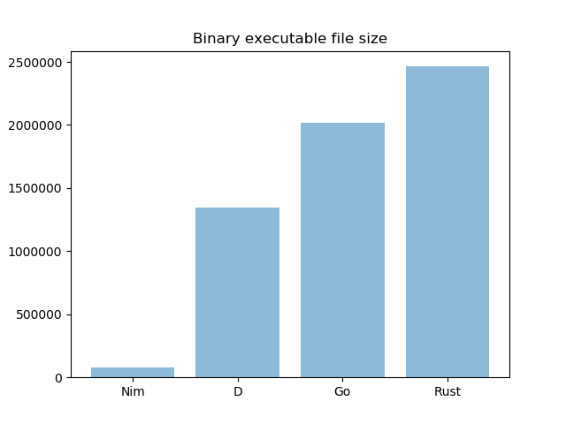

# Simple Programming Language and Compiler Comparison

This repo is used to showcase some programming languages (and compilers) source code and compilation results. Here's what I do to compile the source code:

```bash
D:
    dmd -release computeAllD.d
Nim:
    nim c -d:release computeAllNim.nim
Rust:
    rustc -C opt-level=2 compute-all-rust.rs
Go:
    go build compute-all-go.go
```

Compiler version:

```bash
$ dmd --version
DMD64 D Compiler v2.085.0
Copyright (C) 1999-2019 by The D Language Foundation, All Rights Reserved written by Walter Bright
$ go version
go version go1.12 linux/amd64
$ nim --version
Nim Compiler Version 0.19.4 [Linux: amd64]
Compiled at 2019-02-01
Copyright (c) 2006-2018 by Andreas Rumpf

git hash: b6d96cafc8bcad1f3d32f2910b25cd11a93f7751
active boot switches: -d:release
$ rustc --version
rustc 1.33.0 (2aa4c46cf 2019-02-28)
$
```

Source code for D and Nim was taken from their website. The result can be seen here (generated using [draw.py](draw.py)):



